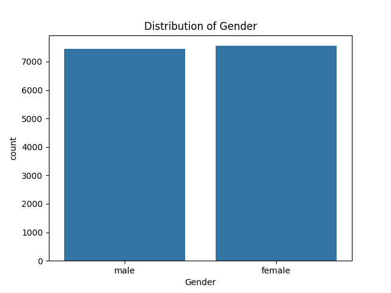
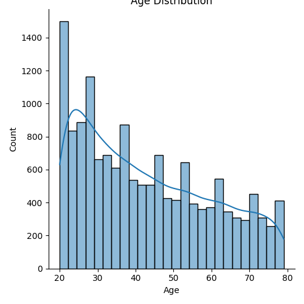
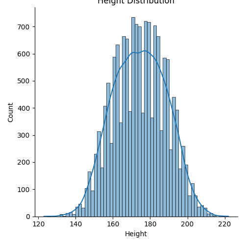
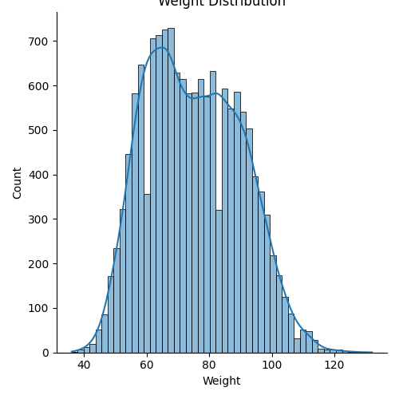
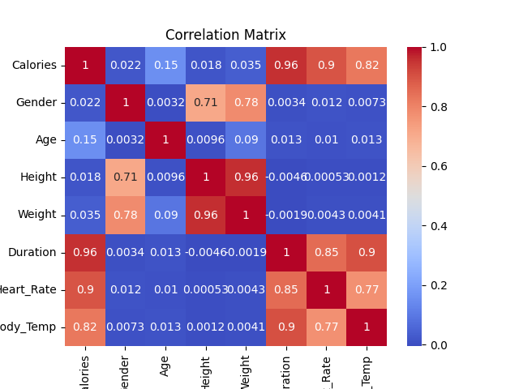

# Calories Burnt Prediction using Machine Learning 🏋️‍♂️🔥

This project focuses on predicting calories burnt during exercise using a Machine Learning model. The dataset includes attributes like gender, age, height, weight, duration, heart rate, and body temperature. The goal is to build an accurate regression model and analyze relationships between variables.

---

## 📁 Dataset

- `calories.csv` – Contains calorie data.
- `exercise.csv` – Contains physical measurements and exercise stats.

---

## 📊 Exploratory Data Analysis

### 1. Gender Distribution

- Equal representation of male and female participants in the dataset.

### 2. Age Distribution

- Majority of the subjects are between 20–40 years old.

### 3. Height Distribution

- Normally distributed around average height ~170 cm.

### 4. Weight Distribution

- Most weights range between 55–85 kg.

### 5. Correlation Matrix

- Strong correlation between Calories and Duration, Heart Rate, and Body Temperature.
- Height and Weight are also highly correlated.

---

## 🧠 Model

The model is implemented using **Linear Regression** from Scikit-learn. The features used are:
- Gender
- Age
- Height
- Weight
- Duration
- Heart Rate
- Body Temperature

Target variable:
- Calories

---

## 🧪 How to Run

```bash
# Step 1: Create virtual environment
python3 -m venv env
source env/bin/activate  # or `env\Scripts\activate` on Windows

# Step 2: Install requirements
pip install -r requirements.txt

# Step 3: Run main script
python main.py

